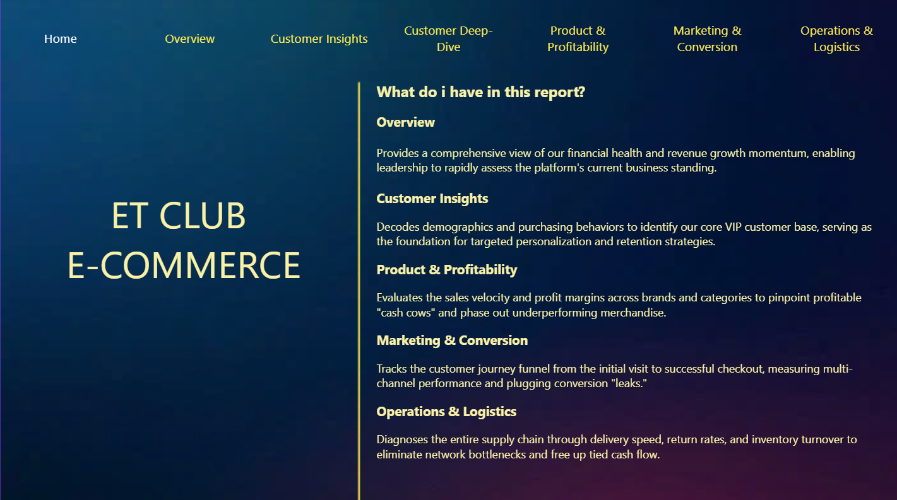
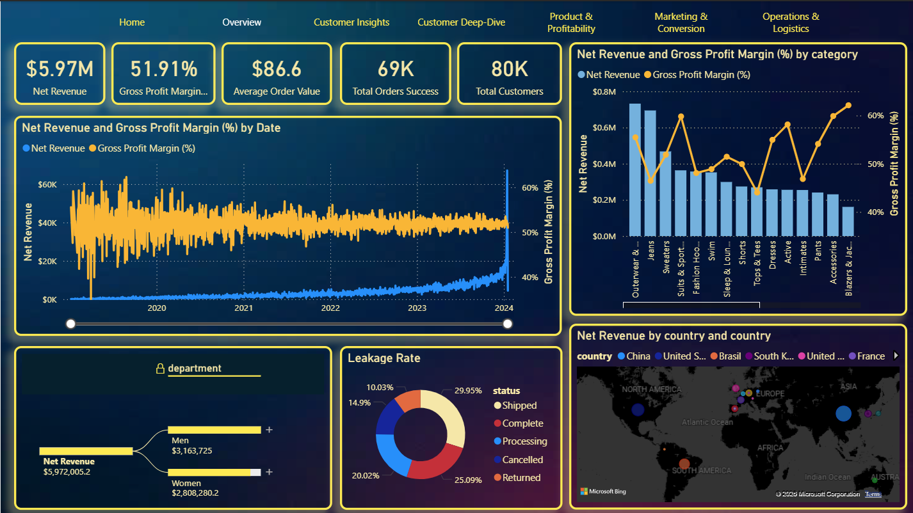
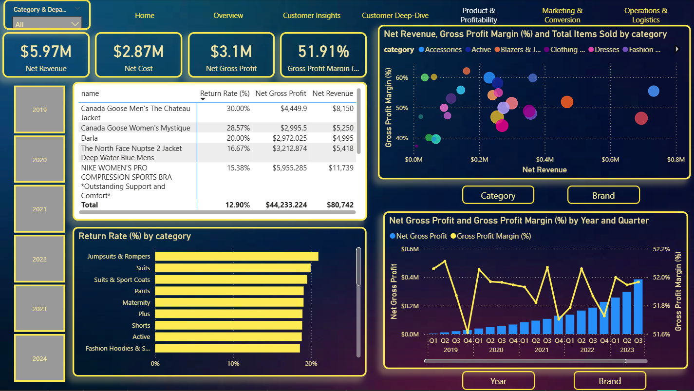
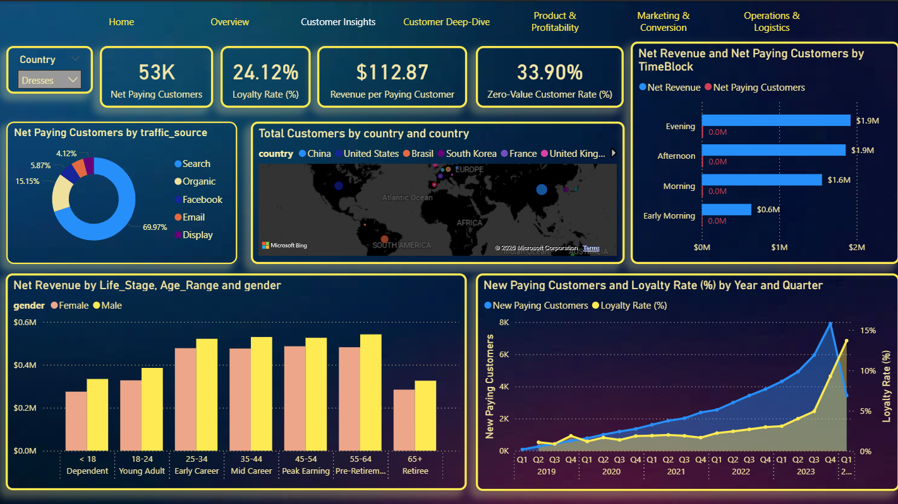
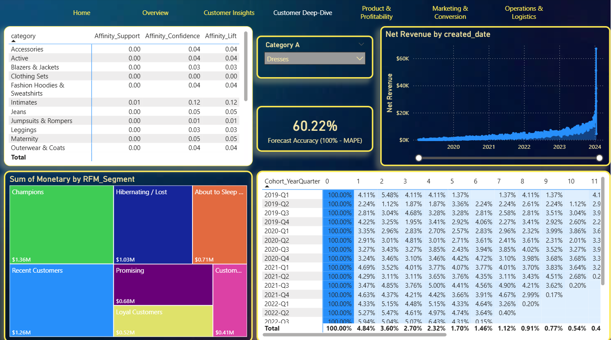
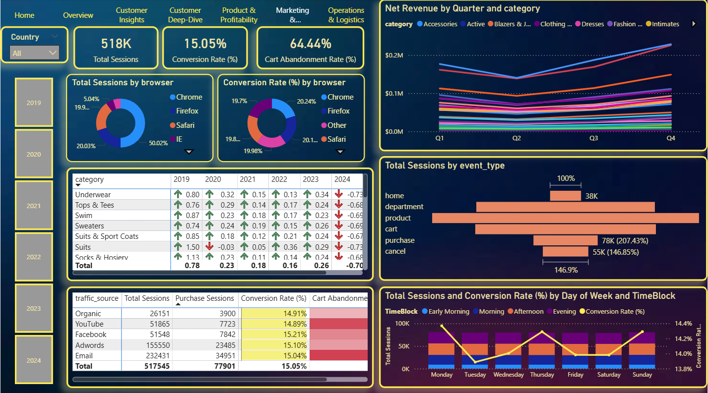
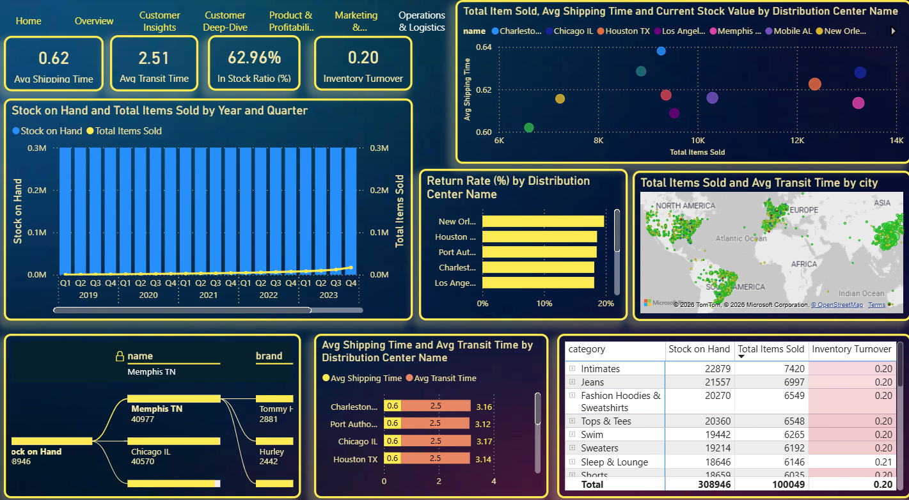

# E-Commerce-Data-Analysis-PowerBI
End-to-end Data Analysis project for ET Club E-commerce platform to optimize net profit margin using Power BI.
# I. THÔNG TIN TỔNG QUAN (PROJECT OVERVIEW)
Tên Project: Phân tích Hiệu quả Kinh doanh và Tối ưu hóa Vận hành cho Nền tảng TMĐT ET Club
Mô tả (Headline): Dự án ứng dụng kỹ thuật phân tích dữ liệu chuyên sâu để chẩn đoán bài toán “Tăng trưởng rỗng” của ET Club: Doanh thu bứt phá mạnh mẽ nhưng biên lợi nhuận ròng đi ngang trong giai đoạn 2019 - 2024. Thông qua việc bóc tách hàng triệu dòng dữ liệu, dự án đã thành công nhận diện các nút thắt trong phễu chuyển đổi, định vị các điểm nghẽn logistics trên bản đồ toàn cầu và đề xuất các chiến lược kinh doanh thực chiến nhằm tối ưu hóa phễu bán chéo, khơi thông dòng tiền và kéo giảm tỷ lệ hoàn trả.
  
Tech Stack (Công nghệ & Kỹ thuật áp dụng):
  1. Power BI: Data Visualization (Tối ưu hóa UX/UI Dashboard), Advanced DAX (Market Basket Analysis, Cohort Retention, RFM Segmentation), Predictive Analytics (ETS Forecasting & MAPE), Geospatial Mapping (Phân tích địa lý logistics).
  2. Data Modeling: Xây dựng mô hình dữ liệu quan hệ (Star Schema), xử lý Disconnected Tables cho thuật toán xác suất.
  3. SQL/Python: Data Cleaning (Tiền xử lý dữ liệu thô, loại bỏ ngoại lai Outliers, xử lý Missing Values).

Phương pháp luận (Analytical Framework): Dự án được triển khai chặt chẽ theo Framework chuẩn hóa 5 bước của một Data Analyst thực chiến:
1.	Xác định mục đích kinh doanh (Business Understanding): Nhận diện bài toán biên lợi nhuận, đặt ra các câu hỏi trọng tâm về vận hành, khách hàng và chuỗi cung ứng.
2.	Chọn lọc & Thiết lập chỉ số (Metric Definition): Xây dựng bộ chỉ số chẩn đoán (AOV, Churn Rate, Avg Transit Time, Inventory Turnover, Return Rate, Lift/Confidence).
3.	Trình bày & Trực quan hóa dữ liệu (Data Visualization): Lựa chọn biểu đồ phù hợp (Scatter Plot, Treemap, Cohort Heatmap, Dual-axis Chart) để bóc tách vấn đề từ tổng quan đến chi tiết.
4.	Tối ưu trực quan & Xử lý nhiễu (Visual Optimization): Áp dụng Conditional Formatting, làm sạch hiện tượng ảo giác dữ liệu (Data Illusion) trên biểu đồ Map, phân cấp thông tin theo nguyên lý F-shape.
5.	Kể chuyện dữ liệu & Đề xuất (Data Storytelling & Recommendations): Chuyển hóa các con số khô khan thành thông điệp chiến lược kinh doanh, đưa ra các Actionable Insights hỗ trợ trực tiếp cho Ban Lãnh đạo ra quyết định.
# II. BỐI CẢNH & MỤC TIÊU KINH DOANH (SITUATION & TASK)
## 1. Bối cảnh doanh nghiệp (The Situation)
ET Club là một nền tảng thương mại điện tử (TMĐT) thời trang đa quốc gia, sở hữu quy mô vận hành khổng lồ với cơ sở dữ liệu lên tới hơn 100.000 khách hàng, quản lý danh mục 27.000+ sản phẩm đến từ 2.800 thương hiệu khác nhau trên toàn cầu.
Trong giai đoạn từ 2019 đến 2022 (và kéo dài sang đầu 2024), ET Club ghi nhận mức tăng trưởng doanh thu gộp cực kỳ ấn tượng, liên tục phá vỡ các cột mốc đỉnh lịch sử nhờ vào các chiến dịch mở rộng thị phần. Tuy nhiên, Ban lãnh đạo đang phải đối mặt với một nghịch lý tài chính nghiêm trọng - Tăng trưởng rỗng (Hollow Growth):
  - Mặc dù doanh thu tăng đều đặn, biên lợi nhuận ròng (Net Profit Margin) lại đi ngang, thậm chí có dấu hiệu suy giảm.
  - Sự mở rộng quá nhanh về quy mô đã làm nảy sinh các lỗ hổng hệ thống trong khâu quản trị hàng tồn kho, tối ưu hóa chi phí logistics và giữ chân khách hàng (Retention), làm tăng chi phí vận hành (OPEX) và vượt qua phần doanh thu tăng thêm.
   
## 2. Mục tiêu dự án (The Task)
Đứng trước bài toán cốt lõi về dòng tiền, vai trò Data Analyst với nhiệm vụ thực hiện rà soát toàn diện mọi khía cạnh của hệ thống vận hành. Mục tiêu cốt lõi bao gồm:
  - Chẩn đoán (Diagnostic Analytics): Khai thác và kết nối hàng triệu dòng dữ liệu từ đa nguồn (Sales, Marketing, Logistics, Inventory) để định vị chính xác các điểm nghẽn (Bottlenecks) đang âm thầm làm thất thoát lợi nhuận (Ví dụ: Tỷ lệ hủy đơn cao, hàng tồn kho chết, tốc độ giao hàng chậm, tỷ lệ rớt phễu thanh toán).
  - Giải mã Hành vi (Behavioral Analytics): Bóc tách phễu hành trình khách hàng và phân khúc giá trị người dùng để trả lời câu hỏi: Kênh marketing nào đang đốt tiền vô ích? Tại sao khách hàng mua một lần rồi rời đi?
  - Đề xuất Thực chiến (Actionable Recommendations): Chuyển hóa các phát hiện dữ liệu thành các chiến lược kinh doanh cụ thể, có thể đo lường được (Data-driven decisions) nhằm khắc phục lỗ hổng vận hành, cải thiện tối đa trải nghiệm khách hàng và vực dậy biên lợi nhuận ròng cho ET Club trong chu kỳ kinh doanh tiếp theo.
# III. CHUẨN BỊ VÀ XỬ LÝ DỮ LIỆU (DATA PREPARATION & MODELING - ACTION)
Giai đoạn tiền xử lý dữ liệu và xây dựng mô hình được thực hiện với độ chính xác cao nhằm đảm bảo tính toàn vẹn, làm nền tảng vững chắc cho hệ thống báo cáo phân tích.
## 1. Sơ đồ Quan hệ Dữ liệu (Data Modeling - Star Schema)
Hệ thống dữ liệu của ET Club được thiết kế theo kiến trúc Star Schema (Mô hình Hình sao), giúp tối ưu hóa hiệu năng truy vấn của VertiPaq Engine trên Power BI đối với tập dữ liệu hàng triệu dòng.
  - Bảng sự kiện (Fact Tables): Chứa các dữ liệu giao dịch sinh ra liên tục bao gồm orders, order_items, events, inventory_items.
  - Bảng danh mục (Dimension Tables): Chứa thông tin chuẩn hóa bao gồm users, products, distribution_centers.
  - Thiết lập Mối quan hệ cốt lõi (1-Nhiều):
  - users (1) --> orders (n): Theo dõi vòng đời mua hàng của từng người dùng.
  - orders (1) --> order_items (n): Phân rã chi tiết từng sản phẩm trong một hóa đơn (xử lý bài toán tách đơn - Split Shipment).
  - products (1) --> order_items (n) & inventory_items (n): Ánh xạ mã sản phẩm để tính toán giá vốn và giá bán.
  - distribution_centers (1) --> products (n): Theo vết nguồn gốc hàng hóa từ kho trung tâm đến tay người dùng.
Kỹ thuật Nâng cao: Xây dựng một Disconnected Table (Bảng không liên kết) có tên Product_A_Dim nhằm mục đích cô lập bộ lọc, phục vụ trực tiếp cho thuật toán tính toán xác suất bán chéo (Market Basket Analysis).
## 2. Nhật ký Làm sạch & Kỹ thuật Đặc trưng (Data Cleaning & Feature Engineering Log)
  - Xử lý Missing Values (Giá trị khuyết): 
    + Logic nghiệp vụ: Các giá trị Blank trong cột sold_date của bảng inventory_items không phải là lỗi hệ thống, mà đại diện cho lượng “Hàng đang tồn kho”. Thay vì xóa bỏ, tạo bộ lọc giữ nguyên các dòng này để tính toán tỷ lệ đọng vốn (In-Stock Ratio).
    + Đối với các đơn hàng bị thiếu shipped_date hoặc delivered_date, thiết lập DAX loại trừ khỏi tính toán thời gian giao hàng (Transit Time) để không làm sai lệch chỉ số vận hành.
  - Xử lý Outliers (Dữ liệu nhiễu & Dị biệt):
    + Nhiễu Logistics: Xử lý điểm dữ liệu giao hàng lên tới 212.82 ngày tại Thượng Hải bằng cách áp dụng hàm AVERAGEX thay vì SUMX, đồng thời thiết lập Rules (Quy tắc cứng) trên biểu đồ Map để loại bỏ hiệu ứng ảo giác dữ liệu do Gradient màu gây ra.
    + Gãy vỡ cấu trúc (Structural Break): Phát hiện dữ liệu năm 2024 bị cắt cụt vào ngày 18/1. Cô lập tập dữ liệu này khỏi bảng so sánh Year-over-Year (YoY) để tránh kết luận sai lầm về sự suy thoái doanh nghiệp.
  - Chuyển đổi Kiểu dữ liệu & Sinh biến mới (Data Type & Transformation):
    + Tách trường created_at (Timestamp) thành Date và Time.
    + Sử dụng DAX SWITCH(TRUE()) để nhóm giờ sinh hoạt thành các TimeBlock (Morning, Afternoon, Evening) phục vụ tối ưu hóa khung giờ chạy Ads.
    + Phân rã độ tuổi khách hàng thành các Segment nhân khẩu học (Dependent, Young Adult, Early Career, Mid Career, Peak Earning, Pre-Retirement, Retiree).
## 3. Hệ thống Chỉ số Tự định nghĩa (Actionable DAX Metrics)
Toàn bộ các chỉ số đo lường (Metrics) được quản lý tập trung tại một bảng ảo _Measures riêng biệt. Các công thức được xây dựng dựa trên nguyên tắc: Tính hành động cao - Minh bạch - Phản ánh đúng thực trạng kinh doanh.
Cụm Chỉ số Lợi nhuận & Bán hàng (Sales & Profitability):
  - Net Revenue: Chỉ tính tổng giá trị (sale_price) trên các đơn hàng có trạng thái Complete hoặc Shipped. Bóc tách hoàn toàn doanh thu ảo từ các đơn Cancelled hoặc Returned.
  - Gross Profit Margin (Biên lợi nhuận gộp): [Net Gross Profit] / [Net Revenue]. Tỷ lệ duy trì ổn định ở mức nền 51.91%, chứng minh năng lực kiểm soát giá vốn (COGS) vượt trội của ET Club.
Cụm Chỉ số Vận hành Chuỗi cung ứng (Operations Metrics):
  - Return Rate (Tỷ lệ hoàn hàng): Số lượng Items trạng thái Returned / Tổng Total Items Sold. Cảnh báo đỏ tại danh mục Suits & Outerwear (lên tới 30%), trực tiếp bào mòn biên lợi nhuận ròng.
  - In-Stock Ratio (Tỷ lệ tồn kho): Báo động đỏ ở mức 62.96% với vòng quay vốn (Turnover) chạm đáy 0.20, phản ánh tình trạng nhập hàng quá tay (Overstock) tạo ra khối lượng tồn kho chết khổng lồ.
  - Avg Transit Time: Thời gian trung bình từ lúc xuất kho đến khi khách hàng nhận được. Mức trung bình toàn cầu là 2.51 ngày, nhưng bóc tách bản đồ cho thấy nhiều “nút thắt cổ chai” (Bottlenecks) vượt mức 5 ngày tại các vùng có nhu cầu mua lớn.
Cụm Chỉ số Tiếp thị & Phân tích Chuyên sâu (Marketing & Advanced Analytics):
  - Conversion Rate (Tỷ lệ chuyển đổi): Đạt 15.05% ở mức tổng thể, trong đó Chrome dẫn đầu về chất lượng Traffic.
  - Cart Abandonment Rate: Lỗ hổng phễu thanh toán lên tới 64.44%, là tác nhân chính làm rò rỉ dòng tiền.
  - Basket Affinity Lift (Hệ số đòn bẩy bán chéo): Hệ số đo lường toán học xác định các sản phẩm “cặp bài trùng” (Ví dụ: Dresses và Intimates có Lift > 1, tỷ lệ mua kèm 12%) phục vụ chiến lược Product Bundling.
# IV. PHÂN TÍCH CHI TIẾT & INSIGHTS (DATA STORYTELLING)
## 1. Góc độ Sản phẩm & Doanh thu (Product & Revenue)
 
### A. Tổng quan Tài chính & Tăng trưởng (Financial Health & Sweet Spot)
  - Thực trạng: Tổng doanh thu thuần (Net Revenue) đạt $5.97 triệu (chủ yếu đến từ khách hàng Nam, chiếm 53%). Đáng chú ý, từ năm 2022 đến đầu 2024, doanh thu bứt phá theo mô hình lũy tiến (Exponential Growth), nhưng biên lợi nhuận gộp (Gross Profit Margin) không bị pha loãng mà thắt chặt và duy trì cực kỳ ổn định ở mức nền 51.91%.
  - Nguyên nhân: ET Club đã bước qua giai đoạn thử nghiệm (2019-2021) và đạt đến sự trưởng thành trong vận hành (Operational Maturity). Doanh nghiệp tăng trưởng nhờ lợi thế quy mô và sức mạnh thương hiệu, thay vì lạm dụng việc giảm giá hay khuyến mãi sâu. Đây là trạng thái tăng trưởng bền vững nhất.
  - Biểu đồ minh chứng: Biểu đồ kết hợp Line and Clustered Column chart (Net Revenue & Gross Profit Margin over time).
### B. Điểm nghẽn Lợi nhuận qua Ma trận Danh mục (The Profit Bottlenecks)
  - Thực trạng: Áp dụng mô hình BCG Matrix, hai danh mục gánh vác doanh thu lớn nhất là Outerwear & Jackets và Jeans (đều cận mốc $0.8 triệu) lại nằm ở nhóm Cash Cow với biên lợi nhuận thấp nhất hệ thống (chỉ 45% - 50%). Ngược lại, nhóm Blazers & Jackets hay Active có biên lợi nhuận chạm đỉnh 60% nhưng doanh thu lại ở mức khá thấp.
  - Nguyên nhân: Điểm nghẽn lợi nhuận nằm ở giá vốn hàng bán (COGS) quá cao của các danh mục Hero Products. Việc dồn ngân sách Marketing vào các nhóm hàng này chỉ mang lại doanh thu thô chứ không tối ưu được lợi nhuận ròng.
  - Biểu đồ minh chứng: Biểu đồ Scartter Chart (Total Items Sold, Gross Profit Margin and Net Gross Profit by Category).
### C. Thương hiệu & Đòn bẩy Bán chéo (Brand Performance & Cross-sell Leverage)
  - Thực trạng: Hai thương hiệu Diesel và Calvin Klein là động cơ doanh thu cốt lõi với biên lợi nhuận trung bình ổn định. Tuy nhiên, thương hiệu Ray-Ban lại là đỉnh cao tỷ suất sinh lời (>60%) dù sản lượng bán ra thấp. Ở chiều ngược lại, Hurley và True Religion đang kéo lùi hiệu quả tài chính với biên lợi nhuận tụt sâu xuống dưới 45%.
  - Nguyên nhân: Doanh nghiệp đang bỏ ngỏ cơ hội khai thác nhóm hàng phụ kiện cao cấp. Cần áp dụng ngay chiến lược bán kèm (Up-sell/Cross-sell): Gợi ý phụ kiện Ray-Ban khi khách hàng chốt đơn Diesel để kéo giá trị trung bình đơn (AOV) đi lên. Đồng thời, cần tái định cấu hình hoặc cắt giảm ngân sách nhập hàng đối với nhóm thương hiệu kém hiệu quả như Hurley.
  - Biểu đồ minh chứng: Biểu đồ Line and Clustered Column chart (Net Revenue and Margin by Brand).
### D. Cảnh báo rủi ro: Kẻ thù của Lợi nhuận ròng (Leakage & Return Analytics)
  - Thực trạng: Tỷ lệ đơn hàng thành công toàn hệ thống chỉ đạt 55.04%. Phần còn lại bị rò rỉ ở khâu Hủy đơn (20.02%) và Hoàn trả (10.03%). Đặc biệt nguy hiểm, các mặt hàng giá trị cao như Suits hay mẫu áo khoác Canada Goose có tỷ lệ hoàn trả lên tới mức báo động đỏ 20% - 30%.
  - Nguyên nhân: Hàng hoàn trả làm phát sinh chi phí logistics ngược khổng lồ. Vấn đề nằm ở khâu tư vấn kích cỡ và trải nghiệm người dùng trên nền tảng. Đề xuất UI/UX tích hợp tính năng “Thử đồ ảo” (Virtual Fitting) hoặc chuẩn hóa lại bảng size cho các mặt hàng cao cấp để kéo tỷ lệ hoàn trả về ngưỡng an toàn dưới 5%.
  - Biểu đồ minh chứng: Biểu đồ Donut (Order Status) và Biểu đồ Bar chart (Return Rate % by Category/Name).
## 2. Góc độ Khách hàng (Customer)
 

 

 
### A. Tệp khách hàng & Phân khúc Giá trị (RFM Segmentation)
  - Thực trạng: ET Club sở hữu 53.000 khách hàng thanh toán (Net Paying Customers) với mức chi tiêu trung bình đạt $112.87. Đáng chú ý, mô hình RFM chỉ ra nhóm Champions và Recent Customers đang gánh vác dòng tiền chủ lực (đạt lần lượt $1.36 triệu và $1.26 triệu). Tuy nhiên, hệ thống đang bị rò rỉ nghiêm trọng khi nhóm Hibernating/Lost và About to Sleep tạo ra một khoản thất thoát doanh thu tiềm năng lên tới $1.74 triệu.
  - Nguyên nhân: Doanh nghiệp đang vận hành theo tư duy “có mới nới cũ”. Hệ thống tối ưu rất tốt việc thu hút khách hàng mới nhưng lại thiếu hụt các kịch bản nuôi dưỡng và chăm sóc tự động. Điều này khiến một lượng lớn khách hàng cũ rơi thẳng vào trạng thái ngủ đông và đóng băng dòng tiền.
  - Biểu đồ minh chứng: Biểu đồ Treemap (Tổng Monetary theo RFM_Segment) và Thẻ KPI (Customer Insights).
### B. Giữ chân & Điểm nghẽn Vòng đời (Cohort Retention & CLV)
  - Thực trạng: Tỷ lệ trung thành (Loyalty Rate) toàn hệ thống chỉ đạt 24.12%. Ma trận Cohort cho thấy sự sụt giảm (Massive Early Churn) mạnh: 90% - 95% khách hàng rời bỏ ngay sau lần mua đầu tiên (Tỷ lệ giữ chân ở Quý 1 chỉ ở mức 2% - 4%). Tuy nhiên, tín hiệu khởi sắc xuất hiện vào cuối 2022 - đầu 2023 khi tỷ lệ này bật tăng mạnh lên mốc 9.01%.
  - Nguyên nhân: Doanh nghiệp đang gánh chi phí tìm kiếm khách hàng mới (CAC) quá cao nhưng Giá trị vòng đời khách hàng (CLV) lại quá ngắn do thói quen mua đơn lẻ (One-time buyers). Sự khởi sắc ở cuối năm 2023 là minh chứng cho một chiến dịch Product-Market Fit thành công, cần được giải mã và nhân rộng để kéo dài vòng đời người dùng.
  - Biểu đồ minh chứng: Ma trận Cohort Heatmap (Cohort_YearQuarter) và Biểu đồ đường (New Paying Customers & Loyalty Rate).
### C. Chân dung Khách hàng & Lỗ hổng Kênh Tiếp thị (Demographics & Zero-Value Users)
  - Thực trạng: Nhóm khách hàng đi làm từ 25-54 tuổi (Early Career đến Peak Earning) là chủ lực mang lại doanh thu áp đảo vào các khung giờ Vàng (Chiều & Tối). Tuy nhiên, kênh Search dù mang về lượng lớn khách hàng thanh toán nhưng cũng tạo ra một lỗ hổng rác khổng lồ với gần 20.000 Zero-Value Customers (Khách hàng không mang lại giá trị).
  - Nguyên nhân: Chiến dịch Paid Search (Google Ads) đang bị nhắm mục tiêu quá rộng hoặc dính từ khóa ảo, dẫn đến việc lãng phí ngân sách vào tệp người dùng chỉ đăng ký mà không mua hoặc mua rồi hủy. Doanh nghiệp cần cắt giảm ngân sách từ khóa kém hiệu quả, dồn lực Retargeting (Quảng cáo bám đuổi) vào nhóm 25-54 tuổi chuyên mua sắm trang phục công sở (Suits, Outerwear) vào khung giờ 14h - 22h để tối ưu hóa ROAS.
  - Biểu đồ minh chứng: Biểu đồ Cột (Net Revenue by Life_Stage & Gender), Biểu đồ Donut (Traffic Source) và Biểu đồ Cột (Zero-Value Customers by Source).
## 3. Góc độ Marketing & Chuyển đổi (Marketing & Conversion)
 
### A. Tiếp thị & Lỗ hổng Giỏ hàng (Marketing Health & Cart Abandonment)
  - Thực trạng: Hệ thống thu hút lượng truy cập khổng lồ (Top of Funnel) với 518.000 Sessions và đạt Tỷ lệ chuyển đổi (Conversion Rate - CR) ấn tượng ở mức 15.05% (vượt xa mức trung bình 2-3% của ngành TMĐT). Tuy nhiên, Tỷ lệ bỏ rơi giỏ hàng (Cart Abandonment Rate) lại chạm mốc báo động 64.44%.
  - Nguyên nhân: Chất lượng Traffic đổ về trang web rất tốt (khách hàng có ý định mua sắm cao), nhưng có thể trải nghiệm tại bước thanh toán (Checkout) đang gặp vấn đề nghiêm trọng. Cứ 3 người nhặt đồ vào giỏ thì có 2 người rời đi. Điểm nghẽn này làm thất thoát dòng tiền lớn nhất của doanh nghiệp. Cần lập tức kích hoạt chiến dịch Remarketing Giỏ hàng (Gửi Email/Push Notification nhắc nhở kèm mã giảm giá nhẹ sau 2 giờ khách bỏ quên giỏ) để kéo giảm tỷ lệ này xuống dưới 55%.
  - Biểu đồ minh chứng: Cụm Thẻ KPI cốt lõi (Total Sessions, Conversion Rate, Cart Abandonment Rate).
### B. Phễu Chuyển đổi & Khủng hoảng Hủy đơn (Funnel Bottleneck & Cancellation Crisis)
  - Thực trạng: Khảo sát phễu hành vi khách hàng (home  department  product  cart  purchase  cancel), dữ liệu chỉ ra sự rớt phễu chấn động ở giai đoạn cuối: So với 78.000 đơn hàng được đặt thành công (purchase), có tới 55.000 đơn hàng bị hủy (cancel).
  - Nguyên nhân: Tỷ lệ hủy đơn chiếm tới hơn 70% so với lượng đơn chốt thành công là một sự thất bại về mặt vận hành. Nguyên nhân thường đến từ: (1) Phát sinh chi phí ẩn lúc thanh toán như phí ship quá cao, (2) Lỗi hệ thống cổng thanh toán khiến đơn bị treo, hoặc (3) Khách hàng đổi ý do thời gian giao hàng dự kiến quá lâu. Việc khắc phục lỗ hổng ở bước cancel này sẽ trực tiếp cứu vãn hàng triệu USD doanh thu.
  - Biểu đồ minh chứng: Biểu đồ Phễu (Total Sessions by event_type).
### C. Hiệu suất Đa kênh (Multi-channel & The Facebook Opportunity)
  - Thực trạng: Về mặt quy mô, Email và Adwords (Paid Search) là hai nguồn doanh thu chủ lực, mang lại hơn 75% tổng lượng traffic với mức CR ổn định (~15%). Tuy nhiên, Facebook dù lượng truy cập chỉ bằng 1/4 so với Email (51.500 Sessions) nhưng lại sở hữu Tỷ lệ chuyển đổi cao nhất toàn hệ thống (15.21%).
  - Nguyên nhân: Doanh nghiệp đang đánh giá thấp và phân bổ ngân sách chưa tương xứng cho Facebook, nơi sở hữu tệp khách hàng có xu hướng chốt đơn dứt khoát nhất. Đề xuất tái phân bổ ngân sách từ các chiến dịch Search kém hiệu quả sang chạy quảng cáo bám đuổi trên kênh Facebook để tối ưu hóa chi phí trên mỗi lượt chuyển đổi (ROAS) và mở rộng tệp khách hàng chất lượng cao.
  - Biểu đồ minh chứng: Bảng ma trận đối soát Nguồn truy cập (Sessions, CR, Cart Abandonment by Traffic Source).
### D. Tăng trưởng Danh mục 2024 (The 2024 Growth Illusion)
  - Thực trạng: Biểu đồ ma trận tăng trưởng cho thấy từ 2019 - 2023, các danh mục chủ lực đều giữ hệ số tăng trưởng dương (màu xanh). Tuy nhiên, bước sang năm 2024, toàn bộ ma trận đồng loạt màu đỏ với hệ số tăng trưởng âm sâu (từ -0.67 đến -0.73).
  - Nguyên nhân:  Đây không phải là một cuộc khủng hoảng suy thoái kinh doanh, mà là hiện tượng gãy vỡ dữ liệu (Data Truncation). Dữ liệu năm 2024 bị cắt cụt ở ngày 18/01, dẫn đến sự bất tương xứng khi đem 18 ngày của 2024 so sánh Year-over-Year (YoY) với  365 ngày của năm 2023. Cần cô lập dữ liệu 2024 ra khỏi các phân tích so sánh tăng trưởng năm để tránh đưa ra các nhận định sai lệch cho Ban lãnh đạo.
  - Biểu đồ minh chứng: Bảng Ma trận (Category Growth Rate YoY).
## 4. Góc độ Vận hành & Chuỗi cung ứng (Operations & Supply Chain)
 
### A. Tốc độ và Tồn kho chết (Speed vs. Inventory Crisis)
  - Thực trạng: Hệ thống vận chuyển đang hoạt động với tốc độ xuất sắc: Chỉ mất trung bình 0.62 ngày để xuất kho và 2.51 ngày để giao đến tay khách hàng. Tuy nhiên, Tỷ lệ hàng sẵn có (In-Stock Ratio) lên tới 62.96% và Vòng quay tồn kho (Inventory Turnover) chạm đáy ở mức 0.20 (so với tiêu chuẩn ngành thời trang là 2.0 - 4.0). Khoảng cách Cung - Cầu qua các quý thể hiện sự chênh lệch khổng lồ (Lượng Stock liên tục duy trì >0.3M nhưng Sold cao nhất chỉ chạm mốc ~17K).
  - Nguyên nhân: Mạng lưới logistics (giao nhận) trơn tru nhưng khâu Thu mua đang gặp lỗi dự báo nghiêm trọng. ET Club đang nhập hàng ồ ạt (mô hình Đẩy) trong khi sức mua thực tế không theo kịp. Lượng tồn kho chết khổng lồ này đang chôn vùi hàng triệu USD vốn lưu động và làm phình to chi phí lưu kho. Doanh nghiệp cần ngay lập tức tổ chức xả kho và tái cấu trúc mô hình dự báo nhập hàng.
  - Biểu đồ minh chứng: Cụm Thẻ KPI (Shipping Time, Transit Time, Turnover) và Biểu đồ Cột kết hợp Đường (Stock and Sold over time).
### B. Đánh giá Năng lực Kho bãi & Điểm nghẽn Cục bộ (Warehouse Bottlenecks)
  - Thực trạng: Kho trung tâm Chicago IL gánh vác khối lượng đơn hàng lớn nhất hệ thống (13.278 đơn) nhưng vẫn duy trì tốc độ xuất kho đỉnh cao chỉ 0.6 ngày. Trái lại, kho Port Authority of NY/NJ có khối lượng đơn hàng chỉ bằng một nửa, nhưng thời gian xử lý lại chậm tương đương, thậm chí có dấu hiệu quá tải.
  - Nguyên nhân: Port Authority of NY/NJ chính là nút thắt cổ chai (Bottleneck) về mặt năng suất. Với lượng công việc ít hơn nhưng thời gian hoàn thành chậm, đội ngũ vận hành cần thanh tra khẩn cấp quy trình phân ca nhân sự, luồng di chuyển hàng hóa hoặc năng lực máy móc tại kho này để tìm ra nguyên nhân gây sụt giảm hiệu suất.
  - Biểu đồ minh chứng: Biểu đồ Phân tán (Scatter Chart: Shipping Time vs. Total Orders) và Biểu đồ Cột (Shipping & Transit Time by Center).
### C. Quản trị Hoàn trả & Tiêu chuẩn Savannah (Return Management & The Savannah Standard)
  - Thực trạng: Phân tích chéo giữa tốc độ và tỷ lệ trả hàng cho thấy kho Savannah dù sở hữu tốc độ xử lý nhanh nhất hệ thống nhưng lại giữ được tỷ lệ hoàn hàng ở mức rất thấp (chỉ 17.88%, xếp thứ 9/10 toàn hệ thống).
  - Nguyên nhân: Savannah đã giải quyết thành công bài toán “Cân bằng giữa Tốc độ và Chất lượng Đóng gói (QC)”. Đây là một điểm sáng vận hành. Thay vì đổ lỗi cho sản phẩm, doanh nghiệp cần cử đội ngũ đến Savannah để học hỏi quy trình, sau đó đúc kết thành bộ Tiêu chuẩn Vận hành (SOP) và áp dụng đồng loạt cho 9 trung tâm phân phối còn lại nhằm giảm tỷ lệ hoàn trả toàn hệ thống.
  - Biểu đồ minh chứng: Biểu đồ Phân tán (Scatter Chart) và Biểu đồ Cột ngang (Return Rate by Distribution Center).
### D. Tái định cấu hình Danh mục Kém hiệu quả (Category Rationalization)
  - Thực trạng: Nhóm Clothing Set đang là điểm yếu vận hành với Vòng quay tồn kho thấp kỷ lục (0.19). Khối lượng hàng tồn và lượng bán ra của danh mục này đều chiếm tỷ trọng rất nhỏ (Stock: 360, Sold: 110).
  - Nguyên nhân: Danh mục này gần như không tạo ra lợi nhuận đáng kể nhưng lại chiếm dụng không gian vật lý và nguồn lực quản lý kho bãi. Đề xuất: Ngừng nhập mới đối với Clothing Set, xả kho cắt lỗ toàn bộ để thu hồi vốn và nhường không gian cho các danh mục có tốc độ luân chuyển nhanh hơn.
  - Biểu đồ minh chứng: Bảng Ma trận (Matrix: Stock, Sold, Inventory Turnover by Category) và Cây phân rã (Decomposition Tree).
# V. ĐỀ XUẤT HÀNH ĐỘNG (RECOMMENDATIONS - RESULT)
Dựa trên kết quả chẩn đoán nguyên nhân cốt lõi dẫn đến tình trạng Tăng trưởng rỗng của ET Club, dưới đây là các chiến lược hành động nhằm tối ưu hóa phễu doanh thu và khơi thông dòng tiền vận hành.
## 1. Giải pháp Marketing & Sales: Tối ưu Phễu Chuyển đổi & Nâng tầm Giá trị Vòng đời
  - Tái cấu trúc Ngân sách Quảng cáo (Ad Spend Reallocation): Dữ liệu cho thấy kênh Search đang gánh tới gần 20.000 Khách hàng ảo (Zero-Value Customers) do nhắm mục tiêu quá rộng. Đề xuất cắt giảm 30% ngân sách từ khóa kém hiệu quả của kênh Search để tái đầu tư sang Facebook Ads kênh đang sở hữu Tỷ lệ chuyển đổi (CR) cao nhất hệ thống (15.21%) nhưng lại bị cấp ngân sách quá thấp.
  - Chiến dịch Cứu hộ Giỏ hàng (Cart Recovery) & Bán chéo (Cross-selling): 
      + Triển khai kịch bản Email/Push Notification tự động tặng mã giảm giá nhỏ sau 2 giờ để khắc phục dòng tiền từ 64.44% Cart Abandonment.
      + Ứng dụng thuật toán Basket Affinity để tạo các combo Bundle (Ví dụ: Mua Váy Dresses gợi ý giảm 10% Intimates có Lift > 1) ngay tại trang Checkout để kích thích tăng Giá trị đơn hàng trung bình (AOV).
  - KPIs Đo lường hiệu quả (Marketing/Sales):
    + Giảm Tỷ lệ Zero-Value Customer: Từ 33.09% xuống dưới ngưỡng 20%.
    + Cải thiện Tỷ lệ Bỏ rơi Giỏ hàng: Kéo giảm từ 64.44% xuống dưới 55%.
    + Tăng Tỷ lệ Giữ chân (Loyalty Rate): Nâng tỷ lệ khách hàng mua lại từ 24.12% lên mức mục tiêu > 30% trong 2 quý tiếp theo.
## 2. Giải pháp Vận hành & Chuỗi cung ứng: Khơi thông Dòng tiền & Tối ưu Logistics
  - Xả Tồn kho chết & Chuyển đổi Mô hình Thu mua (Inventory Clearance): Hệ thống đang báo động đỏ với Vòng quay vốn (Turnover) chạm đáy 0.20 và Tỷ lệ hàng sẵn có lên tới 62.96%. Đề xuất kích hoạt ngay chiến dịch Mega Clearance Sale để xả toàn bộ danh mục kém hiệu quả (như Clothing Set có Turnover 0.19) nhằm thu hồi vốn lưu động. Chuyển đổi mô hình thu mua từ “Đẩy” (nhập ồ ạt) sang” Kéo” (nhập dựa trên thuật toán dự báo ETS) để tránh đọng vốn.
  - Khắc phục lỗ hổng Hoàn trả & Thanh tra Điểm nghẽn Logistics: 
    + Với tỷ lệ hoàn trả 20% - 30% ở các mặt hàng cao cấp (Suits, Canada Goose), đội ngũ UI/UX cần lập tức tích hợp tính năng “Thử đồ ảo” (Virtual Fitting) hoặc chuẩn hóa bảng tính Size thông minh.
    + Mở cuộc thanh tra nội bộ khẩn cấp tại kho Port Authority NY/NJ để giải quyết tình trạng năng suất kém, đồng thời áp dụng quy trình kiểm soát chất lượng đóng gói của kho Savannah (nơi có Return Rate thấp nhất 17.88%) làm Tiêu chuẩn (SOP) cho toàn hệ thống.
  - KPIs Đo lường hiệu quả (Operations):
    + Khôi phục Vòng quay Tồn kho (Inventory Turnover): Đẩy từ mức 0.20 lên tiệm cận biên độ chuẩn của ngành thời trang là 2.0 - 4.0.
    + Kiểm soát Tỷ lệ Hoàn trả (Return Rate): Rút giảm tỷ lệ trả hàng của nhóm Premium xuống dưới mức an toàn 10%, cắt giảm hàng trăm ngàn USD chi phí logistics ngược.
    +Tăng trưởng Net Profit Margin tổng thể: Kỳ vọng cải thiện biên lợi nhuận ròng tăng thêm 3% - 5% nhờ việc khắc phục điểm yếu về chi phí vận hành và lưu kho bãi.
# VI. THIẾT KẾ DASHBOARD & UI/UX (DASHBOARD DESIGN PHILOSOPHY)
Để đảm bảo mức độ tiếp nhận thông tin cao nhất từ Ban giám đốc và các bên liên quan (Stakeholders), hệ thống Dashboard của ET Club được thiết kế tuân thủ nghiêm ngặt các tiêu chuẩn Best Practices về Data Visualization và tỷ lệ Data-Ink Ratio (tối đa hóa lượng mực dành cho dữ liệu, tối thiểu hóa mực cho các thành phần thừa).
## 1. Bố cục Quét thị giác (Layout & F-Pattern)
  - Nguyên lý F-Shape: Áp dụng mô hình theo dõi ánh mắt tự nhiên của con người (từ trái sang phải, từ trên xuống dưới).
  - Góc trên cùng & Trái: Vị trí được dành riêng cho các Thẻ KPI cốt lõi (Net Revenue, Gross Margin, Total Sessions, Avg Transit Time) để nhà quản trị nắm bắt sức khỏe kinh doanh chỉ trong 3 giây đầu tiên.
  - Khu vực trung tâm & Bên phải: Đặt các biểu đồ phân tích xu hướng (Trend lines) và phân bổ (Bar chart/Matrix) để giải thích chi tiết cho các con số KPI phía trên.
  - Điều hướng & Bộ lọc (Navigation & Slicers): Cụm Filter (Year, Quarter, Category) được ghim cố định và gọn gàng ở lề trên hoặc cạnh bên, hoạt động như một thanh công cụ (Control Panel) không làm gián đoạn luồng thị giác đọc biểu đồ.
## 2. Chiến lược Màu sắc (Semantic Color Palette)
  - Tương phản & Nhận diện: Sử dụng tối đa 2-3 màu chủ đạo đồng bộ với bộ nhận diện thương hiệu của ET Club, tạo ra độ tương phản cao để làm nổi bật luồng dữ liệu chính.
  - Màu sắc có ý nghĩa (Semantic Colors): Tuyệt đối không lạm dụng màu sắc sặc sỡ để trang trí. Các gam màu cảnh báo như Đỏ/Cam chỉ được kích hoạt (thông qua Conditional Formatting) khi dữ liệu mang ý nghĩa tiêu cực (Ví dụ: Tỷ lệ Return Rate vượt 15%, Inventory Turnover chạm đáy 0.2, hoặc Transit Time > 5 ngày). Các gam màu Xanh/Vàng đại diện cho sự tăng trưởng dương và ổn định.
## 3. Sự tối giản & Trải nghiệm tương tác (Minimalism & Interactivity)
  - Don't Repeat Yourself (DRY): Lược bỏ hoàn toàn các thành phần gây nhiễu thị giác. Xóa bỏ các đường kẻ lưới (Gridlines); ẩn trục Y ở các biểu đồ cột/đường khi đã có Data Labels trực tiếp trên biểu đồ.
  - Trải nghiệm App-like (Tooltip & Drill-down): Thay vì nhồi nhét mọi thứ lên một trang, tôi thiết kế các Custom Tooltips (Ví dụ: Di chuột vào nhóm tuổi 35-44 sẽ hiện ra cơ cấu chi tiêu riêng của họ) và tính năng Drill-down (Phân rã từ Năm  Quý  Tháng) giúp Dashboard hoạt động mượt mà như một ứng dụng phần mềm thực thụ, cho phép người dùng tự do khám phá dữ liệu theo chiều sâu.

